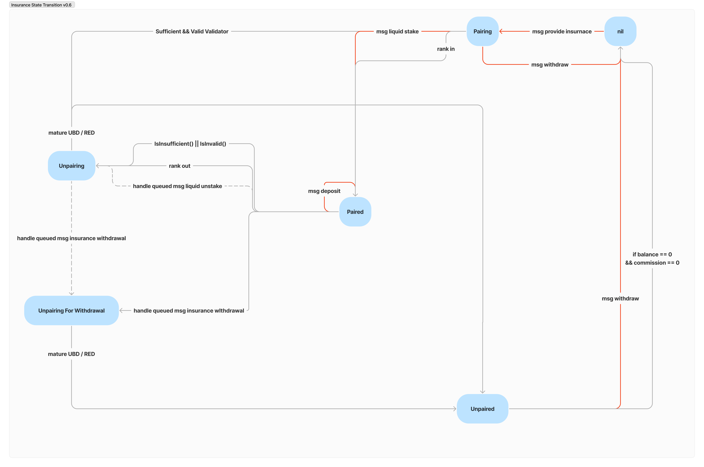

<!-- order: 3 -->

# State Transition

State transitions for both chunks and insurances take place during the EndBlocker when an epoch is reached.

## Diagrams

### Chunk State Transition Diagram

### Insurance State Transition Diagram

## Chunk
### nil → Paired

**Triggering Condition**

When a valid `MsgLiquidStake` is received, it will succeed if there is an empty chunk slot and a `Pairing` insurance is available. If these conditions are not met, the `MsgLiquidStake` operation will fail.

**Operations**

- calculate how much chunks can be created with given `msg.Amount`
- create multiple paired chunks, if possible.
  - get cheapest pairing insurance
  - send chunk size of native tokens to `Chunk`
  - `Chunk` delegate tokens to validator of paired insurance
  - mint ls tokens and send minted ls tokens to `msg.Delegator` (=liquid staker)
  - state transition of `Insurance` (`Pairing` → `Paired`)
  - state transition of `Chunk` (`nil` → `Paired`)

### Paired → UnpairingForUnstaking

**Triggering Condition**
The state transition is triggered when all of the following conditions are satisfied:

- EndBlock & Epoch
- `UnpairingForUnstakingChunkInfo` must exists

**Operations**

- with `UnpairingForUnstakingChunkInfo` which is created upon receipt of a valid `MsgLiquidUnstake`.
  - get a related `Chunk`
  - if chunk is still Paired, then undelegate a `Chunk`
    - state transition of `Insurance` (`Paired` → `Unpairing`)
    - state transition of `Chunk` (`Paired` → `UnpairingForUnstaking`)
  - if not, don't do anything

### Paired → Unpairing

**Triggering Condition**
The state transition is triggered when all of the following conditions are satisfied:
- EndBlock & Epoch
- one or more of the following conditions are met:
  - when paired `Insurance` start to be withdrawn
  - when paired Insurance's balance < 5.75% of chunkSize tokens
  - when a validator becomes invalid(e.g. tombstoned)

**Operations**

- state transition of paired `Insurance` (`Paired` → `Unpairing` | `UnpairingForWtihdrawal`)
- state transition of `Chunk` (`Paired` → `Unpairing`)

### UnpairingForUnstaking → nil

**Triggering Condition**

EndBlock & Epoch

**Operations**

- finish unbonding
  - burn escrowed lsTokens
  - send chunk size tokens back to the liquid unstaker
- state transition of `Insurance` (`Unpairing` → `Pairing` | `Unpaired`)
- delete `UnpairingForUnstakingChunkInfo`
- delete `Chunk` (`UnpairingForUnstaking` → `nil`)

### Unpairing → Pairing

**Triggering Condition**
The state transition is triggered when all of the following conditions are satisfied:

- EndBlock & Epoch
- when there are no candidate insurances to pair with
- chunk is not damaged

**Operations**

- state transition of `Insurance` (`Unpairing` | `UnpairingForWithdrawal` → `Unpaired`)
- state transition of `Chunk` (`Unpairing` → `Pairing`)

### Unpairing → nil

**Triggering Condition**
The state transition is triggered when all of the following conditions are satisfied:

- EndBlock & Epoch
- chunk is damaged (insurance fails to cover all penalties, resulting in the chunk size becoming smaller than the designated fixed value)

**Operations**

- send all balances of `Chunk` to reward pool
- state transition of `Insurance` (`Unpairing` | `UnpairingForWithdrawal` → `Unpaired`)
- delete the chunk (`Unpairing` → `nil`)

## Insurance

### nil → Pairing

**Triggering Condition**

Upon receipt of a valid `MsgProvideInsurance` when an empty chunk slot and a pairing insurance is available. 
Otherwise `MsgProvideInsurance` fails.

**Operations**

- escrow insurance tokens from provider
- create pairing `Insurance`

### Pairing → Paired

**Triggering Condition**
One or more of the following conditions are met:

- EndBlock & Epoch
- if there are an empty slot and got `MsgLiquidStake`

**Operations**

- state transition of `Insurance` (`Pairing` → `Paired`)
- state transition of `Chunk` (`nil` → `Paired`)

### Paired → UnpairingForWithdrawal

**Triggering Condition**
The state transition is triggered when all of the following conditions are satisfied:

- EndBlock & Epoch
- if there are a `WithdrawInsuranceRequest`

**Operations**

- consume **`WithdrawInsuranceRequest`**
  - state transition of `Insurance` (`Paired` → `UnpairingForWithdrawal`)
  - state transition of `Chunk` (`Paired` → `Unpairing`)
  - delete `WithdrawInsuranceRequest`

### Paired → Unpairing

**Triggering Condition**
The state transition is triggered when all of the following conditions are satisfied:

- EndBlock & Epoch
- one or more of the following conditions are met:
  - paired `Chunk` is started to undelegate **OR**
  - When paired Insurance's balance < 5.75% of chunkSize tokens **OR**
  - When a validator becomes invalid(e.g. tombstoned)

**Operations**

- state transition of `Insurance` (`Paired` → `Unpairing`)
- state transition of paired `Chunk` (`Paired` → `Unpairing`)

### Unpairing → Pairing

**Triggering Condition**
The state transition is triggered when all of the following conditions are satisfied:

- EndBlock & Epoch
- `Insurance` is still valid
  - pointing a valid validator (bonded)
  - insurance balance >= 7% of chunk size of tokens 

**Operations**

- state transition of `Insurance` (`Unpairing` → `Pairing`)

### UnpairingForWithdrawal → Unpaired

**Triggering Condition**

EndBlock & Epoch

**Operations**

- state transition of `Insurance` (`UnpairingForWithdrawal` → `Unpaired`)

### UnpairingForWithdrawal | Unpairing → nil

**Triggering Condition**
The state transition is triggered when all of the following conditions are satisfied:

- EndBlock & Epoch
- Unpairing chunk is damaged(insurance already send all of its balance to chunk, but still not enough) 
- insurance balance is 0 

**Operations**

- state transition of `Insurance` (`UnpairingForWithdrawal` | `Unpairing` → `nil`)
 
### Unpaired → nil

**Triggering Condition**

Upon receipt of a valid `MsgWithdrawInsurance` message for unpaired `Insurance`

**Operations**

- send all balances of Insurance to provider
- send all commissions of Insurance fee pool to provider
- delete insurance object (`Unpaired` → `nil`)