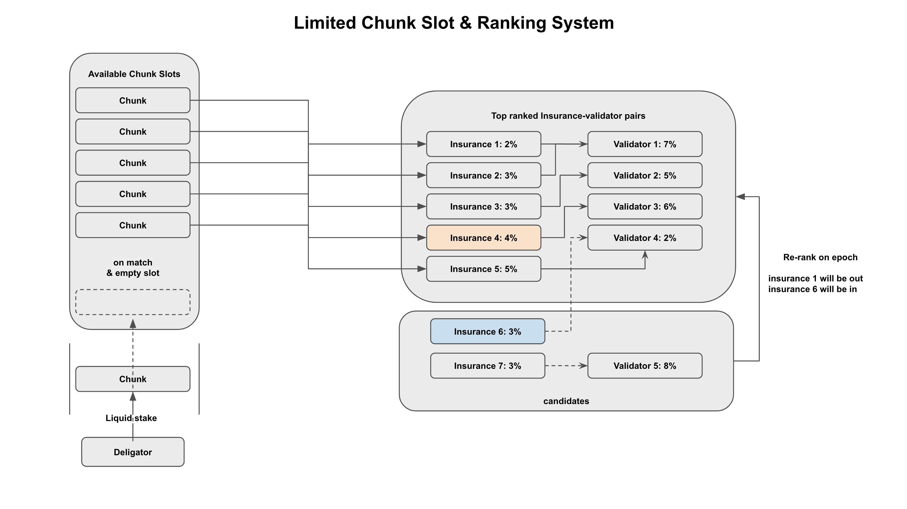
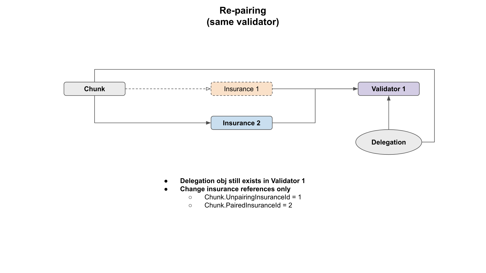

# ABCI

This document describes the prerequisites needed to understand the BeginBlocker and EndBlocker logic of the liquidstaking module.

## Insurance Ranking & Re-Pairing

Each insurance is ranked at epoch. The ranking is based on the sum of the validator's commission rate and the insurance's fee rate. 

The above figure depicts a situation in which five insurances are provided and three chunks are created through liquid staking. 
The current insurance offerings are as follows.

| id   | fee rate | validator commission rate | total |
|------|----------|---------------------------|-------|
| 1    | 2%       | 7%                        | 9%    |
| 2    | 3%       | 7%                        | 10%   |
| 3    | 3%       | 5%                        | 8%    |
| 4    | 4%       | 6%                        | 10%   |
| 5    | 5%       | 2%                        | 7%    |

When a chunk is created, the chunk is matched with the insurance that provides the lowest total fee rate.
Therefore, in the above figure, the chunk is matched with insurance 1, 3, and 5.

Before the next epoch, a new insurance 6 is provided. Insurance 6 points to validator 4, so the total fee rate is 5%.
Since the total fee rate is more attractive than the currently matched insurance, it will be ranked in the next epoch.

The ranked out insurance is insurance 1, which has the highest fee rate among the currently matched insurances.

When re-pairing, the processing method differs depending on whether the rank-in insurance points to the same validator as the rank-out insurance.

The following figure shows the case where the rank-in insurance points to the same validator as the rank-out insurance.

Chunk's delegation remains in the same validator, and only the reference value of the chunk changes.

If the rank-in insurance points to a different validator than the rank-out insurance, the delegation of the chunk is re-delegated to the validator of the rank-in insurance.

Because re-delegation period is same with epoch duration, the re-delegation will be finished at the next epoch.

## Slashing Penalty Covering

### Basic

When a validator is slashed, the chunk's delegation may be lost due to downtime or double sign. 
That's the reason why insurance exists. Insurance exists to cover such losses.

The above figure shows a situation where a chunk's delegation is lost due to a validator's double sign.
Whe insurance cover the loss, there are two cases depending on the size of the loss. 

**Case 1:** When insurance can cover the loss completely (penalty <= insurance balance, colored in orange)

Insurance send the penalty amount of coins to chunk and chunk delegate that coins to the validator.

**Case 2:** When insurance cannot cover the loss completely (penalty > insurance balance, colored in red)

Chunk's value is less than chunk size even if insurance cover the loss with all of its balance.
In this case, insurance send all of its balance to reward pool and chunk's delegation is un-delegated and un-delegated tokens are sent to reward pool at the next epoch.

Arbitrager will buy that tokens from reward pool with lscanto. Instead of leaving the chunk as unusable, making it consumable by lscanto is more valuable. 

### Advanced

Chunk can have paired insurance and unpairing insurance at the same time. This is because when re-pairing, 
the insurance with a high fee rate for the limited chunk slot is replaced with a low fee rate insurance.

In a situation where a chunk has both paired insurance and unpairing insurance, which insurance has responsibility for covering the loss?
This question is answered depending on **the time when the cause of slashing occurred**. 

If the cause occurred before the epoch, then the unpairing insurance is responsible for covering the loss.
If the cause occurred after the epoch, then the paired insurance is responsible for covering the loss.

In this section we will look at the situation where the unpairing insurance has to cover the loss with the following figure.

Blue insurance originally covered the chunk. Since the blue insurance points to validator A, the delegation of the current chunk is delegated to A.

1. Orange insurance with a lower fee rate (3%) than the blue insurance (5%) was provided. 
Since there is no chunk slot left and the epoch has not yet been reached, the insurance remains in a pairing state.
2. Validator A double signs. Since no evidence has been submitted yet, no penalty has been imposed.
3. Epoch is reached and the orange one is paired with the chunk, and the original blue one becomes an un-pairing insurance.
4. Evidence of double sign by A is submitted and accepted. In this process, the delegation shares of the chunk that was in B is damaged, 
and the chunk's delegation shares differs from the `sharesDst` in the `ReDeleagtion` obj.
5. At the upcoming epoch, the unpairing insurance will cover the loss.

The cause of the slashing **occurred before the epoch(re-pairing)**, so the unpairing insurance (blue one) is responsible for covering the loss because that loss is not related with the paired insurance (orange one).
This rule is applied to the case also where the paired insurance and the unpairing insurance point to the same validator.

### Why Begin Block / End Block?

Re-delegation can occur when there were re-pairing in the previous epoch and changed insurances point to different validators.
To track responsibility for the loss during re-delegation period, we need Redelegation obj stored in staking module.

But Redelegation obj is deleted at the Begin Block of staking module when the re-delegation period is over and 
staking module's begin blocker is executed before liquidstaking module's begin blocker.

So if we only use end blocker, then we cannot track the responsibility exactly because ReDelegation obj is gone.

